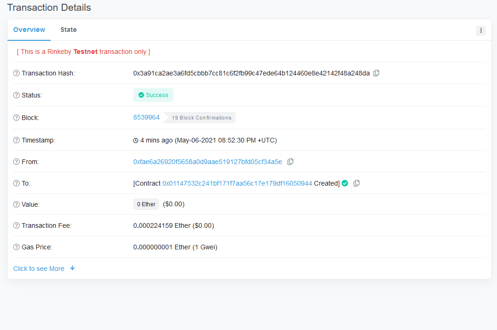
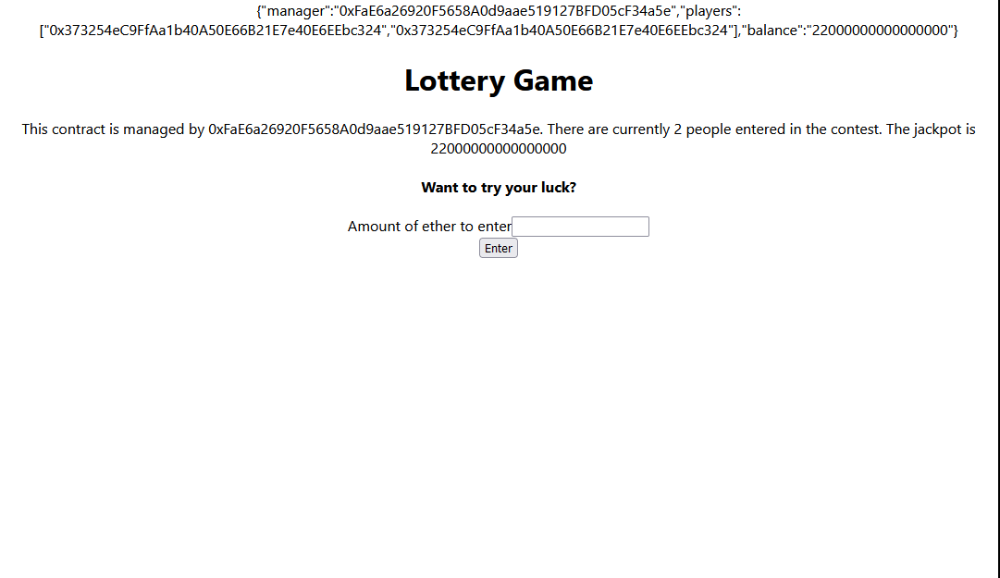

# Ethereum

I started this journey to learn about the Blockchain and "Web 3.0". There's A LOT of moving pieces involved in understanding this whole eco-system.

Please note, the goal of this is to not make any project in here look "pretty" but to have them work and deployed.

## End Result - not done yet

## [1. My First Smart Contract](https://rinkeby.etherscan.io/address/0x01147532c241Bf171f7Aa56c17E179dF16050944)

This is nothing too crazy. But, its cool nonetheless.

### Subjects learnt

- Setting up VS Code to work with [`.sol`](https://docs.soliditylang.org/en/v0.8.4/)(Solidity) files.
- How to create a smart contract and deploy it on [remix](https://remix.ethereum.org/#optimize=false&runs=200&evmVersion=null&version=soljson-v0.4.26+commit.4563c3fc.js).
- Testing smart contracts with [`mocha`](https://mochajs.org/).
- How to compile a [smart contract](https://www.investopedia.com/terms/s/smart-contracts.asp).
- How to deploy a smart contract on the [`Rinkeby`](https://www.rinkeby.io/#stats) test network.

## [1. Decentralized Lottery Application](https://lottery-dapp.netlify.app/)

### Note - YOU MUST HAVE [METAMASK](https://metamask.io/) to interact w/ this application. Also, you can only enter the lottery. Not pick the winner. 

This was actually really insightful into how the whole decentralization of the web could play out. There's no DB just smart contracts and the Ethereum network. Holy cow the possibilites, I can't think of any right now lol. But, I need to more research into the blockchain as a whole and let the concepts simmer a bit.

### Subjects learnt
- How to interact w/ a smart contract via a React app.
- Utilizing Metamask to send ether into a smart contract.